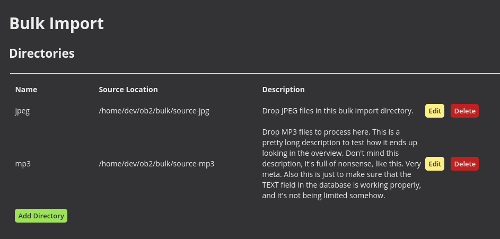
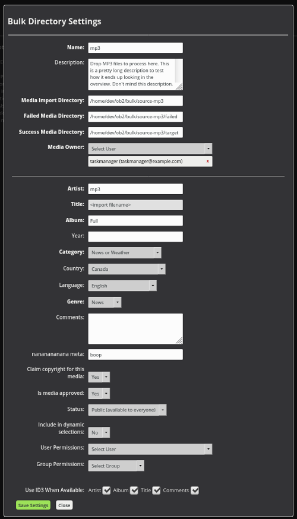

 

{: .screenshot}

# Bulk Import
{:.no_toc}

* TOC
{:toc}

Bulk Import enables importing large libraries in a batch retaining metadata.

Create multiple filters and Watch folders

Ingest entire media libraries and metadata

 

{: .screenshot}

## Bulk Import settings

Filter setup

Watch folder setup
